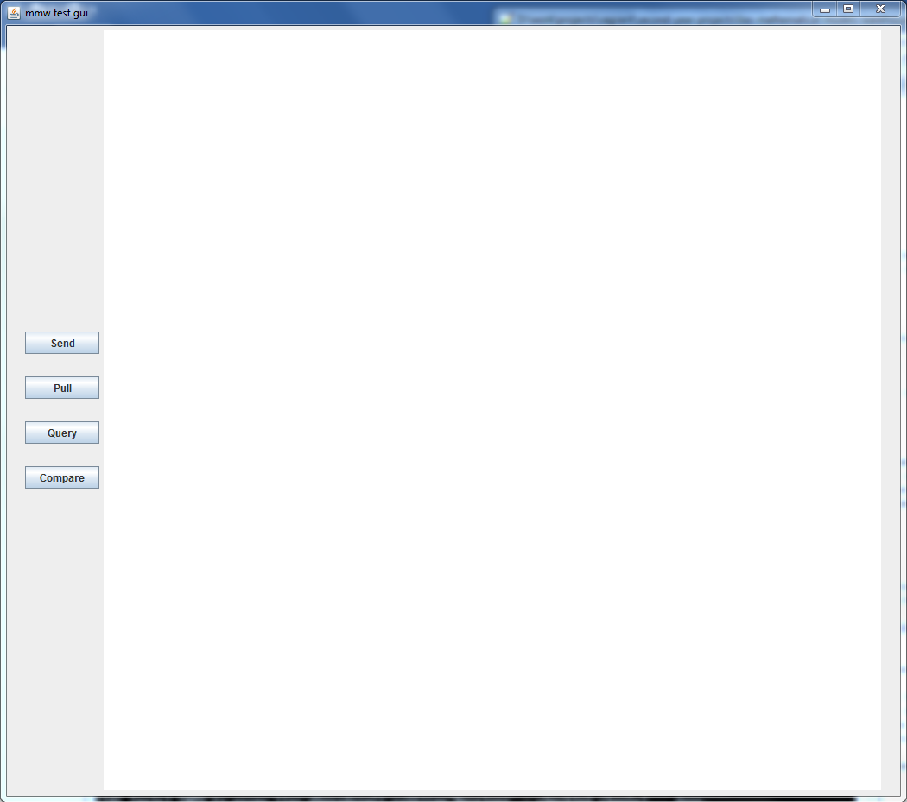
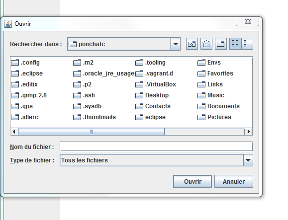
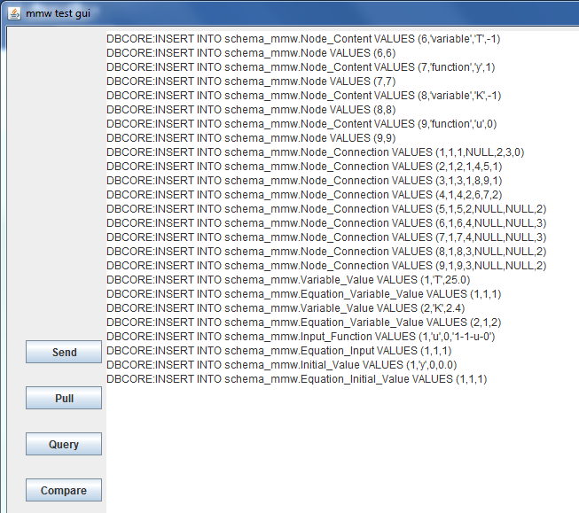
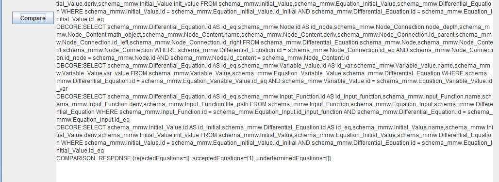
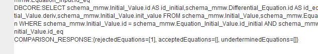

# Documentation for running Mathematical Models Warehouse prototype: A tutorial and test scenario

Authors: Cyrille Ponchateau, Ladjel Bellatreche, Mickael Baron
Date: February 03, 2017
Last update: July 13, 2018

## Start the interface

You will need to compile the source files, before actually starting the project. To do so, open a shell and browse to your local copy of the project. Once in the root directory of the project:

```bash
$ cd microservices-src/mathmouse/ 
$ mvn clean package #will compile the source of the whole project
$ cd ../.. #go back to root of the project
$ java -jar dockermanager-SNAPSHOT-0.0.1.jar
```

You might be asked for sudo password, for docker commands to be correctly executed. Then the different services (rabbitmq, comparator, comparator manager, generator and postgresdatabase) will be set up and started. When they are all set, you will need to press ctrl+z, to put the process in background and the $bg to make the process keep running in background. Now you are ready to use the interface:

```bash
$ cd microservices-src/mathmouse/dbgui/target
$ java -jar dbgui-SNAPSHOT-0.0.1.jar
```

The following window should appear:



## Send an equation

Click on the upload button (in the red rectangle). The following window should appear on the previous one:



Go to your local copy of the project and browse to the xmls2.0 resources file: `microservices-src/mathmouse/dbgui/src/main/resources/xmls2.0`.

You will have to select one of the file and click on  (in the red rectangle) to open and send the file content to the database. You can repeat the operation for the two other files (not necessary for the rest of the scenario).

*TIP:* if browsing to the file is a little long, copy the files of xmls2.0 into a more practical location.

After each file sending, the equation should appear in the navigation tree on the left of the main window:



## Send a time series and compare to the equations in the database

You can now try to send some time series to be compared to the equation(s) in the database. To do so, click on the Create Job tab, then on the Open button. You will have to browse again in the prototype directory and to the following: `microservices-src/mathmouse/dbgui/src/main/resources/timeseries-sources`

*TIP:* you can also copy the content in a more practical location.

There are three equations examples contained in the equationN.xml files, where N is 1, 2 or 3. Those equations are the following:

* Equation1: $ Ty'(t)+y(t)=Ku(t),T=25.0,K=2.4,y(0)=0.0 $
* Equation2: $ Ty'(t)+y(t)=Ku(t),T=2.0,K=1.3,y(0)=0.0 $
* Equation3: $ \frac{y''(t)}{w^2} +\frac{2m}{w}y'(t)+y(t)=Ku(t),K=0.8,m=0.4,w=0.1,y(0)=0.0,y'(0)=0.0 $

There are three time series files DataN.txt, where N is 1, 2 or 3. DataN.txt is the numerical solution of equationN. Therefore, if you send Data1.txt, you should see the following:



If you send the equation1 file first, then its ID in the database is also 1. Therefore, the file Data1.txt contains the solution of the equation of ID 1, in the database. If you look at he line in the red rectangle, you can see an “acceptedEquations” attribute, which contains a list of one element equal to 1. It is the ID of the equation that match the data in Data1.txt. The other rejectedEquations and undetermindedEquations are empty (because there are no other equations in the database). If you sent the other equations, then you should see 2 and/or three appear in the rejectedEquations list. Unfortunately, there is no example of undeterminedEquations, so you should not be able to see any ID appear in this list. But, should this case happen, you would.

Now if you send Data2.txt or Data3.txt, you will see the one appear in the rejectedEquations list, like on the following:



*Note:* if the line does not appear, it is because the window contains too much text, so some of it is printed outside of the text view. You can safely close the interface and start it again to clean the text view and try again.

## Quick population of the database

In order to quickly have models inserted in the database, you can use the populator service. From the project root directory:

```bash
$ cd microservices-src/mathmouse/populator
$ source set-environment.sh
$ cd target
$ java -jar populator-SNAPSHOT-0.0.1.jar
```

You can modify the files you want to add, by going in the following directory: `microservices-src/mathmouse/populator/src/main/resources/xmls`.